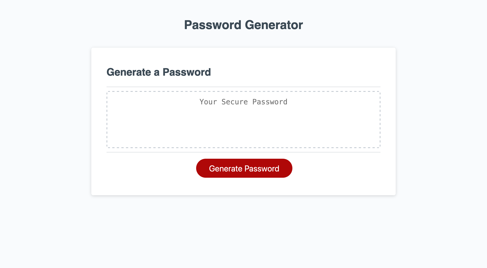

# Password-Generator
Week 3 Challenge

In this challenge, I was given the task of editing a starter code so that when the application is run, it features a working password generator. This application contains the following features:

- when the button is clicked, a series of prompts appear for the user to select the password criteria
    * password length?
    * uppercase letters?
    * lowercase letters?
    * numbers?
    * symbols?

- when all prompts are answered the generator returns a randomized password based on the users selected critera

Live application: https://yaserhdev.github.io/password-generator/

* Source code: yaser/bootcamp/password-generator